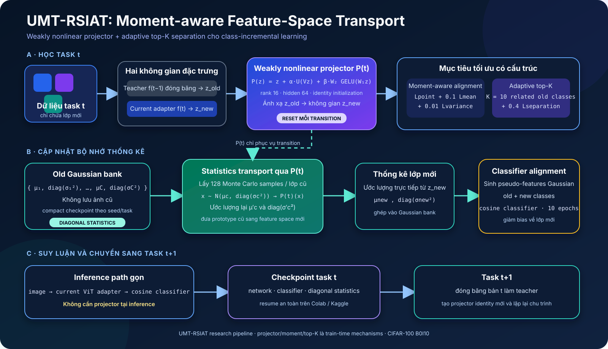
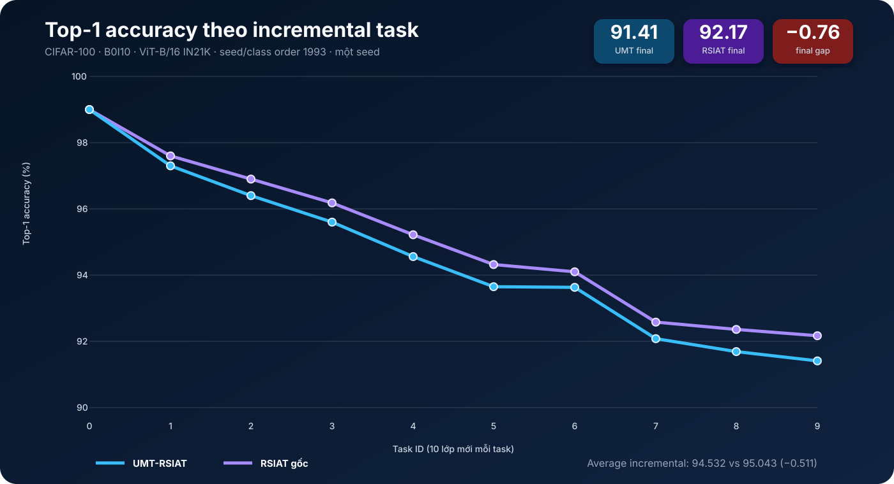
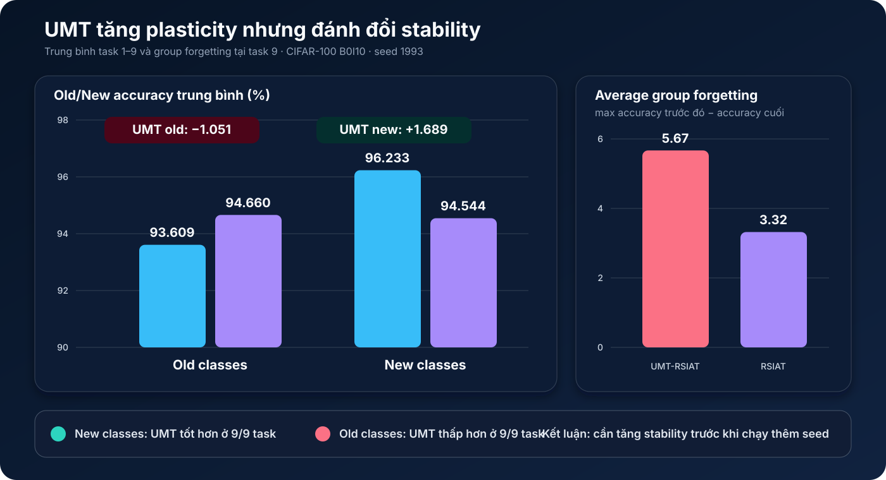

# UMT-RSIAT

**Weakly Nonlinear, Moment-Aware Transport RSIAT with Adaptive Top-K Separation**

UMT-RSIAT là một hướng nghiên cứu cho class-incremental learning không lưu ảnh
cũ. Phương pháp kế thừa ViT adapter và cosine classifier của RSIAT, sau đó bổ
sung một projector phi tuyến yếu để vận chuyển biểu diễn và thống kê lớp cũ sang
không gian đặc trưng mới.

> **Trạng thái nghiên cứu:** pipeline đã chạy hoàn chỉnh CIFAR-100 B0I10 đến
> task 9 và resume được qua nhiều phiên Colab. Kết quả một seed hiện chưa vượt
> RSIAT gốc; repository này trình bày cả phương pháp lẫn kết quả âm để tiếp tục
> chẩn đoán và ablation, không tuyên bố UMT-RSIAT đã đạt state of the art.

[](https://colab.research.google.com/github/PhThuan-tech/RSIAT/blob/main/RSIAT_UMT_Colab.ipynb)
[](RSIAT_UMT_Kaggle.ipynb)
[](HUONG_NGHIEN_CUU_UMT_RSIAT.md)

## Ý tưởng chính

Khi adapter được cập nhật ở task mới, feature space bị dịch chuyển. Prototype và
phân phối Gaussian đã lưu cho lớp cũ vì thế không còn khớp hoàn toàn với biểu
diễn hiện tại. UMT-RSIAT xử lý vấn đề này bằng bốn thành phần:

1. **Weakly nonlinear projector:** học ánh xạ gần identity từ feature space cũ
   sang feature space mới bằng một nhánh low-rank tuyến tính và một residual phi
   tuyến nhỏ có gate.
2. **Moment-aware alignment:** căn chỉnh từng điểm, class mean và diagonal
   variance thay vì chỉ ghép cặp feature theo từng mẫu.
3. **Adaptive top-K separation:** chỉ tập trung đẩy xa các prototype lớp cũ liên
   quan và dễ nhầm nhất với lớp mới.
4. **Statistics transport:** đưa mean/variance cũ qua projector bằng diagonal
   Monte Carlo, ghép với thống kê lớp mới rồi dùng Gaussian pseudo-features để
   cân chỉnh cosine classifier.

Projector chỉ tồn tại trong giai đoạn chuyển tiếp giữa hai task. Đường suy luận
cuối vẫn là `image → ViT adapter hiện tại → cosine classifier`.

## Kiến trúc và luồng hoạt động



Với feature cũ `z_old`, projector được xây dựng theo dạng:

```text
P(z) = z + α · U(Vz) + β · W₂ GELU(W₁z)
```

Các lớp cuối của hai nhánh residual được khởi tạo bằng zero, nên `P(z) = z` tại
thời điểm bắt đầu mỗi transition. Loss projector hiện dùng:

```text
L = Lclass
  + 1.0 Lpoint
  + 0.1 Lmean
  + 0.01 Lvariance
  + 0.4 Lseparation
  + 0.001 Lcomplexity
```

Luồng của một task tăng dần:

1. Đóng băng mô hình task trước làm teacher và cập nhật adapter/classifier hiện
   tại bằng dữ liệu lớp mới.
2. Trích `z_old` và `z_new` từ cùng ảnh task hiện tại, rồi fit projector
   `P(t): z_old → z_new`.
3. Áp dụng point/moment alignment và adaptive top-K separation với prototype cũ.
4. Vận chuyển mean và diagonal variance của lớp cũ qua `P(t)` bằng 128 mẫu Monte
   Carlo cho mỗi lớp.
5. Ước lượng thống kê lớp mới, ghép vào Gaussian bank và chạy classifier
   alignment.
6. Lưu network, classifier và compact diagonal statistics để resume task tiếp.

## Kết quả CIFAR-100 seed 1993

Thiết lập so sánh dùng cùng CIFAR-100 B0I10, class order 1993, ViT-B/16 IN21K,
batch size 64, 10 epoch task đầu, 30 epoch cho mỗi task tăng dần và 10 epoch
classifier alignment. Baseline là chuỗi full run RSIAT cuối cùng trong log cùng
seed; UMT tắt SSCA gốc và thay bằng pipeline transport/moment/top-K nêu trên.



| Chỉ số | UMT-RSIAT | RSIAT gốc | UMT − RSIAT |
|---|---:|---:|---:|
| Average incremental top-1 | 94.532 | 95.043 | −0.511 |
| Final top-1 | 91.41 | 92.17 | −0.76 |
| Average incremental top-5 | 99.485 | 99.547 | −0.062 |
| Final top-5 | 99.19 | 99.27 | −0.08 |



Phân tích `old/new` cho thấy cơ chế hiện tại thay đổi trade-off rất nhất quán:

- UMT cao hơn RSIAT ở lớp mới tại **9/9 task**, trung bình `+1.689` điểm;
- UMT thấp hơn RSIAT ở lớp cũ tại **9/9 task**, trung bình `−1.051` điểm;
- average group forgetting tăng từ `3.32` lên `5.67` điểm;
- final top-1 vì thế thấp hơn baseline `0.76` điểm.

Kết quả hiện tại cho thấy UMT tăng **plasticity** nhưng chưa bảo vệ đủ
**stability**. Đây là kết quả của một seed, chưa phải kiểm định ý nghĩa thống kê.
Phân tích đầy đủ theo task, loss component và classifier alignment nằm trong
[tài liệu hướng nghiên cứu](HUONG_NGHIEN_CUU_UMT_RSIAT.md#18-phân-tích-full-run-cifar-100-seed-1993).

## Thành phần đã triển khai

| Thành phần | File chính | Vai trò |
|---|---|---|
| UMT learner | `models/RSIAT_adapter.py` | Train adapter, projector, transport và classifier alignment |
| Projector | `models/projectors.py` | Identity, low-rank và weakly nonlinear projector |
| Moment/top-K loss | `utils/research_losses.py` | Class-wise moments, adaptive threshold và hinge separation |
| Checkpoint/resume | `models/base.py`, `trainer.py` | Seed-isolated task checkpoint và compact statistics |
| Full CIFAR config | `exps/umt_adapter_cifar224.json` | Full run seed 1993 |
| Smoke config | `exps/umt_adapter_cifar224_smoke.json` | Kiểm tra nhanh toàn pipeline |
| ImageNet-R config | `exps/umt_adapter_imagenetr.json` | Cấu hình mở rộng sang ImageNet-R |
| Component tests | `tests/test_research_components.py` | Kiểm thử projector, moment và top-K |

## Cài đặt

Khuyến nghị Linux/Google Colab/Kaggle với GPU CUDA và Python 3.10 trở lên.

```bash
conda create -n umt-rsiat python=3.10 -y
conda activate umt-rsiat
pip install torch torchvision torchaudio --index-url https://download.pytorch.org/whl/cu118
pip install -r requirements.txt
```

Repository dùng API `timm>=1.0`; môi trường cũ có `timm==0.6.12` cần nâng cấp
trước khi import model.

Kiểm tra GPU nếu cần:

```bash
python testGPU.py
```

## Chuẩn bị CIFAR-100

CIFAR-100 được đọc bằng `torchvision.datasets.CIFAR100`. Dữ liệu cần nằm dưới:

```text
data/datasets/
├── cifar-100-python/
└── cifar-100-python.tar.gz
```

Nếu thư mục đã giải nén hợp lệ, torchvision sẽ tái sử dụng và không tải lại.
Notebook Colab liên kết `data/datasets` với
`MyDrive/RSIAT_data/datasets`, giúp dữ liệu tồn tại sau khi runtime reset.

## Chạy UMT-RSIAT

Chạy unit tests và smoke test trước:

```bash
python -m unittest tests.test_research_components
python main.py --config ./exps/umt_adapter_cifar224_smoke.json
```

Chạy full CIFAR-100 seed 1993:

```bash
python main.py --config ./exps/umt_adapter_cifar224.json
```

Full config mặc định có:

```json
{
  "resume": true,
  "isolate_runs": true,
  "keep_last_checkpoint": true,
  "compact_diagonal_checkpoint": true,
  "projector_type": "weakly_nonlinear",
  "statistics_transport": "diagonal_mc",
  "separation_topk": 10
}
```

Checkpoint được tách theo seed:

```text
ckpt/umt_weak_moment_topk/cifar224/10_10/seed_1993/task_N.pkl
```

`resume=true` sẽ tiếp tục từ checkpoint task lớn nhất hợp lệ. Chỉ resume khi
method, seed, class order và cấu hình không thay đổi. `keep_last_checkpoint=true`
chỉ giữ checkpoint mới nhất để tiết kiệm Drive; đặt thành `false` nếu cần phân
tích offline mọi task.

## Google Colab và Kaggle

- [`RSIAT_UMT_Colab.ipynb`](RSIAT_UMT_Colab.ipynb) clone/cập nhật repository,
  lưu dataset và checkpoint trên Google Drive, đồng thời train trên local disk
  của Colab.
- [`RSIAT_UMT_Kaggle.ipynb`](RSIAT_UMT_Kaggle.ipynb) nhận checkpoint task trước
  từ Kaggle Input, chạy một số task giới hạn bởi `max_tasks_per_run`, rồi đóng
  gói output cho phiên tiếp theo.

Trong notebook, `output_root` chuyển toàn bộ `logs/` và `ckpt/` sang vùng lưu
trữ bền vững; không cần clone lại repository khi chỉ tiếp tục resume.

## Hướng thí nghiệm tiếp theo

Không nên chạy thêm nhiều seed ngay với cấu hình đang thua baseline. Thứ tự
ablation ưu tiên:

1. projector + statistics transport, tắt moment và top-K;
2. transport + moment, tắt top-K;
3. transport + top-K, tắt mean/variance;
4. tăng có kiểm soát `mean_weight` và `variance_weight` để bảo vệ lớp cũ;
5. log trực tiếp gate, residual ratio, gradient norm và prototype drift;
6. chỉ chạy thêm ít nhất hai seed khi tìm được cấu hình không thua baseline ở
   seed 1993.

Nếu transport-only đã làm accuracy giảm, cần kiểm tra diagonal Monte Carlo hoặc
thử shared low-rank covariance. Nếu chỉ cấu hình bật top-K làm giảm stability,
cần giảm/schedule `separation_weight` hoặc dùng threshold mềm hơn.

## Tài liệu

Toàn bộ động cơ, ưu/hạn chế của RSIAT, công thức UMT, phạm vi triển khai và phân
tích log được ghi tại:

- [`HUONG_NGHIEN_CUU_UMT_RSIAT.md`](HUONG_NGHIEN_CUU_UMT_RSIAT.md)

Các hình thống kê trong README được dựng từ hai log:

- `logs/umt_adapter/cifar224/0/10/umt_weak_moment_topk_1993_pretrained_vit_b16_224_in21k_adapter (1).log`
- `logs/adapter/cifar224/0/10/all_1993_pretrained_vit_b16_224_in21k_adapter.log`

## Nguồn gốc nghiên cứu

UMT-RSIAT là biến thể thử nghiệm phát triển trên RSIAT. Khi sử dụng repository,
hãy trích dẫn công trình RSIAT gốc:

```bibtex
@inproceedings{zhao2026representation,
  title={Representation-Steered Incremental Adapter-Tuning for Class-Incremental Learning with Pre-Trained Models},
  author={Zhao, Jiarui and Huang, Libo and Li, Xiangqi and An, Zhulin and Yang, Chuanguang and Wang, Yu and Diao, Boyu and Xu, Yongjun},
  booktitle={Proceedings of the IEEE/CVF Conference on Computer Vision and Pattern Recognition},
  pages={18010--18020},
  year={2026}
}
```

Codebase cũng kế thừa cấu trúc và ý tưởng từ
[PILOT](https://github.com/LAMDA-CL/LAMDA-PILOT) và
[SSIAT](https://github.com/HAIV-Lab/SSIAT).
